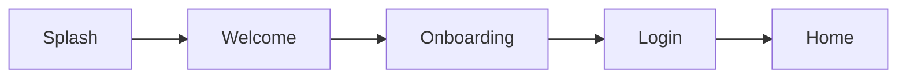
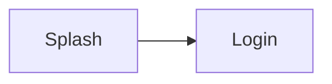
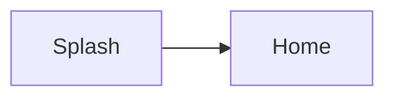
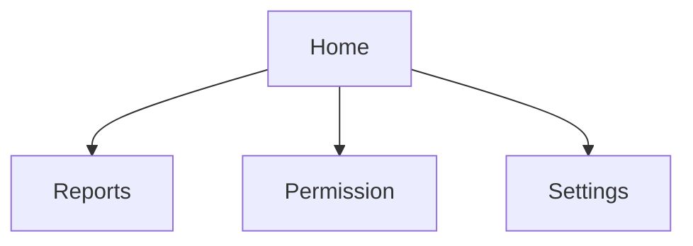
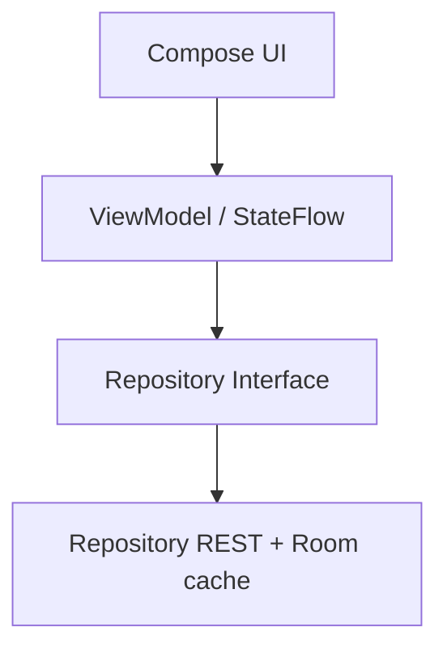
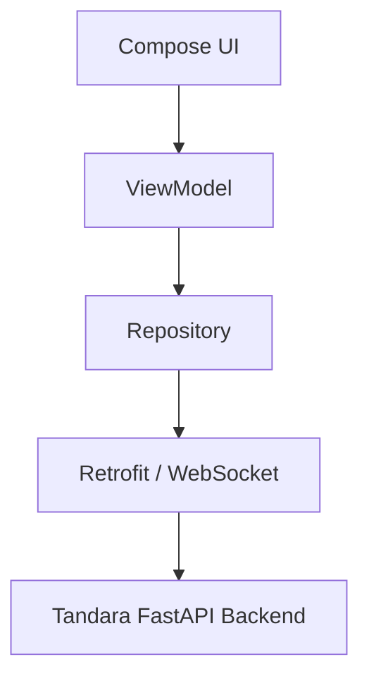
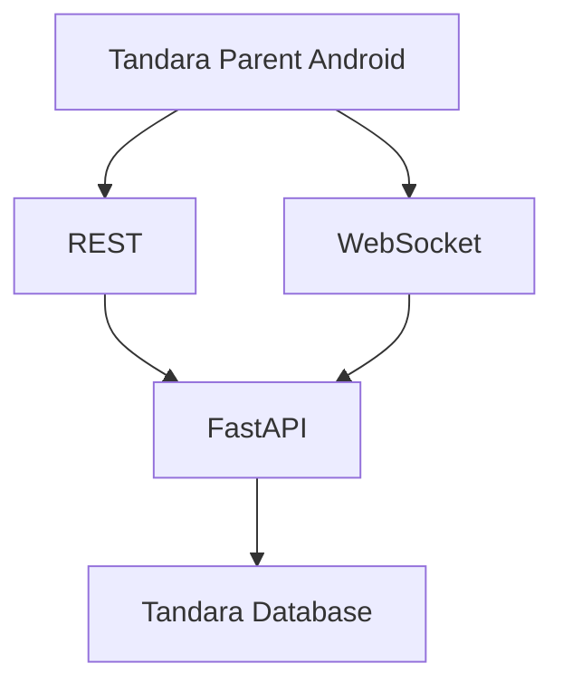

# Tandara Parent

Aplikasi Android untuk orang tua dalam ekosistem presensi sekolah Tandara.

Tandara Parent memungkinkan orang tua memantau informasi kehadiran siswa yang ditugaskan kepada mereka dari perangkat Android. Project ini merupakan prototype/demo untuk Developer Day 2026, bukan layanan publik yang siap produksi.


## Tentang Tandara Parent

Tandara adalah ekosistem presensi sekolah yang berfokus pada penggunaan sistem face recognition untuk pencatatan kehadiran siswa. Aplikasi ini dirancang sebagai antarmuka Android bagi orang tua untuk melihat status kehadiran anak yang telah ditugaskan kepada mereka.

Alur konseptualnya adalah:

Student
↓
Face Recognition
↓
Tandara Backend
↓
Attendance Data
↓
Tandara Parent

Autentikasi Parent, data siswa, kehadiran, laporan, pengajuan izin, notifikasi, dan pembaruan WebSocket menggunakan backend Tandara. Cache Room mendukung pembacaan data terakhir saat offline; data cache selalu ditandai sebagai data lama dan backend tetap menjadi sumber kebenaran.

## Aturan Produk

Tandara Parent mengikuti prinsip berikut:

- Satu akun orang tua = satu siswa yang ditugaskan.
- Orang tua tidak memilih siswa secara manual dari daftar yang tidak terikat.
- Tidak ada switcher siswa atau pemilihan anak yang arbitrer di UI.
- Identitas siswa pada akhirnya harus ditentukan dari akun parent yang terautentikasi dan otorisasi backend.
- Backend tetap menjadi otoritas utama untuk kontrol akses.

Repo Android saat ini tidak mengimplementasikan penguatan otorisasi yang bersifat real-time di sisi client. Prinsip tersebut dipertahankan sebagai aturan desain untuk integrasi mendatang.

## Fitur

### Fitur yang berjalan

Aplikasi yang ada saat ini mencakup beberapa layar dan alur UI sebagai prototype demo:

- Splash screen
- Welcome screen
- Onboarding
- Login UI orang tua
- Dashboard Home
- Ringkasan kehadiran
- Riwayat/rekap kehadiran
- UI permohonan izin/cuti
- UI notifikasi
- Profil orang tua
- Settings
- Tema terang / gelap / mengikuti sistem
- Greeting dan format tanggal dalam Bahasa Indonesia
- Persistensi tingkat onboarding, tema, dan status sesi menggunakan DataStore

Ketersediaan endpoint dan kebijakan backend menentukan data yang dapat ditampilkan. Aplikasi tidak membuat data bisnis contoh saat koneksi gagal.

### Fitur lanjutan

- Push notification tetap belum diterapkan; aplikasi merekonsiliasi peristiwa yang terlewat melalui REST saat kembali online.

## Alur Aplikasi

### Alur first install



### Alur saat kembali membuka aplikasi



### Alur ketika sudah terautentikasi secara lokal



### Navigasi utama



Route utama yang terdefinisi di aplikasi saat ini adalah: Home, Reports, Permission, Settings, serta submenu profile/privacy/FAQ/about. Tidak ada route tambahan yang dibuat untuk fitur backend nyata.

## Preview

Tidak ada screenshot produk yang ditemukan di repository ini yang layak dipakai sebagai preview aplikasi. Untuk saat ini, placeholder disimpan agar tidak ada link rusak:

<!-- Tambahkan screenshot aplikasi di docs/screenshots/ -->
<!-- Layout yang disarankan: Home | Reports | Permission | Settings -->

## Tech Stack

### Aktif

- Kotlin
- Jetpack Compose
- Navigation Compose
- ViewModel
- StateFlow
- Preferences DataStore
- Manual AppContainer / lightweight service locator

### Disiapkan / scaffolding

- Retrofit
- OkHttp
- Moshi
- Room (offline read cache untuk data Parent)
- Coil (tersedia, tetapi tampaknya belum menjadi sumber gambar utama di runtime)

Retrofit dan OkHttp menangani REST serta WebSocket; cache Room hanya menyimpan hasil sinkronisasi untuk dibaca saat offline dan bukan sumber data otoritatif.

## Arsitektur

Arsitektur saat ini bersifat ringan dan cocok untuk prototype UI:



Interaksi app saat ini dilakukan melalui `DefaultAppContainer` yang menginisialisasi repository dan `SessionManager` secara manual. Tidak ada dependency injection framework seperti Hilt/Koin dalam repo ini.

### Integrasi aktif



REST dan WebSocket menggunakan API Tandara; koneksi memakai URL yang dikonfigurasi saat build/run.

## Ekosistem Tandara

Repository ini hanya mencakup aplikasi Android parent. Sistem Tandara yang lebih besar terdiri dari komponen yang terpisah:

```text
Tandara
├── Admin IT Web Dashboard
├── Guru/Piket Web Dashboard
├── Face Recognition Attendance
├── FastAPI Backend
└── Tandara Parent Android App
```

Dashboard web, backend, dan sistem absensi face recognition adalah proyek yang terpisah dari aplikasi ini. Tandara Parent hanya bertindak sebagai client Android untuk orang tua/wali.

## Arsitektur Demo

Developer Day 2026 berorientasi pada demo lokal-first. Salah satu skenario yang dimaksud adalah:

```text
Laptop Server
├── FastAPI
├── Database
├── Face Recognition
├── DroidCam / Camera
└── Web Dashboard
       │
       └── Local Network
            ├── Dashboard Client
            └── Android Parent App
```

Pada demo lokal, ponsel Android dan server laptop harus dapat dijangkau dalam jaringan lokal yang sama. Ini penting untuk uji integrasi demo, namun repo yang ada belum mengeksekusi koneksi backend yang nyata.

## Persyaratan Development

Untuk menjalankan project ini secara lokal, diperlukan:

- JDK yang kompatibel dengan Android Gradle Plugin yang dipakai project
- Android SDK
- Platform Android sesuai dengan `compileSdk` yang didefinisikan project
- ADB
- Emulator Android atau perangkat fisik
- Android Studio atau VS Code dengan tooling Android yang sesuai

Project ini menggunakan Gradle Wrapper:

```bash
./gradlew
```

Konfigurasi saat ini memakai JDK 17, Gradle Wrapper 9.3.1, Android Gradle Plugin 9.1.1, dan Android platform `android-36.1`. Tidak diperlukan instalasi Gradle global.

## Menjalankan Project

Persiapan pertama kali memeriksa toolchain yang sudah terpasang. Script tidak memasang paket atau mengubah konfigurasi sistem secara otomatis:

```bash
./scripts/setup-android.sh
```

Pemeriksaan environment tanpa build atau perubahan device:

```bash
./scripts/check-android.sh
```

Untuk pengembangan harian, hubungkan ponsel melalui USB, aktifkan USB debugging, setujui prompt otorisasi, lalu jalankan:

```bash
./scripts/run-android.sh
```

Script akan membangun APK debug, memverifikasi application ID, meng-install atau memperbarui aplikasi tanpa uninstall, lalu membukanya. Jika ada beberapa device, pilih serial secara eksplisit dengan `--device <serial>`. Gunakan `--no-build` untuk meng-install APK debug yang sudah ada, `--logs` untuk mengikuti log aplikasi, atau `--check` untuk menjalankan pemeriksaan environment saja.

Identitas aplikasi Android adalah `id.tandara.parent`. Perubahan application ID membuat Android memperlakukan instalasi lama `com.aistudio.tandara.kztw` sebagai aplikasi terpisah; launcher tidak menghapusnya.

## Build APK

Build debug dijalankan dengan `./gradlew assembleDebug`; APK dihasilkan di `app/build/outputs/apk/debug/app-debug.apk`. APK bersifat output lokal dan tidak perlu dikomit. Tidak ada konfigurasi release signing untuk workflow ini.

## Status Integrasi Backend

Status aplikasi saat ini:

| Komponen | Status |
|---|---|
| Android UI | Implemented |
| Local preferences | Implemented |
| REST backend Parent | Implemented |
| Room offline read cache | Implemented |
| Parent WebSocket | Implemented |
| FCM / push notification | Not Implemented |

Offline/reconnect behavior remains subject to device testing against a reachable Tandara backend; cached records are not authoritative.

## Alur Backend Aktif

Konsep integrasi yang diharapkan adalah:



Rincian endpoint aktif ada di `docs/backend-integration-map.md`. Offline/reconnect behavior masih menunggu validasi fisik pada perangkat Vivo dengan backend LAN yang berjalan.

## Keamanan & Privasi

Prinsip yang penting untuk dipegang:

- Akses parent harus diotorisasi oleh backend.
- Client Android tidak boleh dipercaya sebagai otoritas keputusan akses siswa.
- Satu akun parent mewakili satu siswa yang ditugaskan.
- Proses face recognition adalah bagian dari sistem absensi sekolah, bukan fitur di aplikasi parent Android.
- Tandara Parent tidak memerlukan permission kamera untuk face recognition.
- Jangan menyimpan API key, token, password, atau secret di repo.
- Token autentikasi di masa depan harus disimpan dengan mekanisme penyimpanan yang aman dan sesuai kebutuhan produk.

Repo ini tidak mengimplementasikan mekanisme keamanan produksi yang nyata. Prinsip di atas lebih menggambarkan desain yang benar untuk integrasi mendatang.

## Tema

Aplikasi menyediakan dukungan tema terang, gelap, dan mengikuti sistem. Default yang terlihat pada code adalah mode `light` (Terang), dan `MainActivity` memetakan setting appearance menjadi `light`, `dark`, atau `system`.

## Struktur Project

Struktur utama source Android adalah:

```text
app/src/main/java/id/tandara/parent/
├── MainActivity.kt
├── TandaraApplication.kt
├── core/
│   ├── common/          Utility, app container, permission, helper
│   ├── designsystem/    Semantic color, theme, style token
│   ├── navigation/      Routes dan NavHost Compose
│   ├── network/         Wrapper hasil API dan observer konektivitas
├── data/
│   ├── local/           Room cache untuk data hasil sinkronisasi
│   ├── remote/          Retrofit client, DTO, REST services
│   ├── realtime/        Parent WebSocket dan reconnect
│   ├── repository/      Repository backend dan cache
│   └── session/         Preferences DataStore session/theme/onboarding
├── domain/
│   ├── model/           Model domain parent, student, attendance, leave
│   └── repository/      Interface repository
└── ui/
    ├── auth/            Login screen dan ViewModel
    ├── components/      Shared UI component
    ├── home/            Dashboard utama
    ├── onboarding/      Welcome & onboarding flow
    ├── permission/      Form izin/cuti
    ├── reports/         Riwayat dan ringkasan presensi
    ├── settings/        Pengaturan, profile, FAQ, privasi, about
    └── splash/          Router awal untuk onboarding/session
```

## Roadmap

- [x] Fondasi UI Android parent
- [x] First-run onboarding
- [x] Sistem tema
- [x] Dashboard Parent berbasis backend
- [x] Stabilisasi build/toolchain
- [x] Identitas Android dan USB dev launcher
- [x] Autentikasi parent nyata
- [x] Integrasi REST backend
- [x] Integrasi realtime Parent WebSocket
- [ ] Offline/reconnect physical-device validation
- [x] Integrasi leave request
- [x] Notifikasi REST persisten
- [x] WebSocket realtime
- [ ] Push notification background

Checklist di atas mencerminkan status yang dapat didukung oleh kode dan dokumen yang ada. Belum ada tanggal rilis yang ditetapkan.

## Tim

Team: Kena Scan

Anggota yang tercantum dalam project:

- Muhammad Dzarel Alghifari — Team Leader & Lead Developer
- Azzam — Hardware & Technical Support
- Labib — Testing & Documentation

## Developer Day 2026

Tandara merupakan project mahasiswa yang dikembangkan dalam konteks Developer Day 2026. Fokus project ini adalah prototyping ekosistem presensi sekolah berbasis face recognition dan aplikasi Android untuk orang tua.

## Tandara di Web

Struktur publik yang direncanakan adalah:

- tandara.id → landing page proyek resmi
- app.tandara.id → halaman showcase/download untuk Tandara Parent

Domain tersebut tidak dikonfirmasi sebagai situs yang aktif dalam repo ini, dan tidak ada bukti bahwa app.tandara.id saat ini mendistribusikan APK. Dalam konteks Developer Day, sistem absensi dapat tetap bersifat local-first sementara website digunakan untuk presentasi proyek.

## Lisensi

Belum ada file LICENSE yang ditemukan di repository ini. Lisensi proyek belum ditentukan di repo saat ini.

## Catatan Akhir

Proyek ini adalah aplikasi Android Parent untuk ekosistem Tandara. UI dibangun dengan Compose; sesi disimpan aman, data backend direkonsiliasi melalui REST/WebSocket, dan cache lokal hanya menyediakan pembacaan terakhir saat offline. Status kesiapan rilis publik tetap berbeda dari keberhasilan integrasi teknis.
# Android ↔ Local Backend Development

The laptop and physical Android phone must be connected to the same trusted LAN. Determine the laptop's LAN IPv4 address (for example with `ip -4 addr`; do not use `localhost` or `127.0.0.1` on the phone).

Start Tandara with deliberate LAN binding:

```bash
cd /home/dzarel/Projects/Tandara
./start-tandara.sh --lan --no-browser
```

This binds FastAPI to `0.0.0.0:8000` for the local network; it does not configure public internet exposure. Configure and launch Android with the current laptop address:

```bash
./scripts/run-android.sh --clean --api-url http://LAPTOP_LAN_IP:8000/
```

Alternatively set `TANDARA_API_BASE_URL` in the environment or pass it as the Gradle property `-PTANDARA_API_BASE_URL=...`. Debug builds allow local cleartext HTTP; release builds do not opt into cleartext. Log in with a Parent username/password provisioned by Admin IT. Never place a real password or JWT in project files.

The app authenticates the Parent and reads assigned-student, attendance, report, leave, and notification data from the backend. Cached responses remain explicitly stale until REST reconciliation succeeds; FCM/push is not implemented.
